# 🛡️ Awesome Cloud Data Loss Prevention (DLP) Ecosystem

  

  
  
  
  
  

---

## 📌 Executive Summary & Market Insights

> 💡 **Market Size & Structure**: The global Data Loss Prevention (DLP) market is valued at approximately **$42.87 Billion in 2026** and is projected to reach **$111 Billion by 2031** (CAGR ~21%). The sector is **moderately fragmented**: enterprise suite leaders (Google Cloud, Microsoft, Broadcom/Symantec) dominate infrastructure-native and full-stack security deployments, while agile startups and specialized open-source scanners capture growing niches in secrets scanning, Kubernetes security, and AI/LLM prompt guardrails.

This curated list tracks notable **SaaS platforms** and **open-source projects** for **Cloud Data Loss Prevention (DLP)**, sensitive data discovery, secrets scanning, PII redaction, policy enforcement, and regulatory compliance monitoring across cloud workloads, endpoints, and CI/CD pipelines.

---

## 📑 Table of Contents

- [☁️ SaaS & Enterprise DLP Platforms](#-saas--enterprise-dlp-platforms)
- [🔓 Open-Source GitHub Projects](#-open-source-github-projects)
  - [🔑 Secrets Scanning & CI/CD Gating](#-secrets-scanning--cicd-gating)
  - [🤖 AI Guardrails & LLM DLP](#-ai-guardrails--llm-dlp)
  - [🌐 Network, Endpoint & Container DLP](#-network-endpoint--container-dlp)
  - [📊 Data Governance & Metadata Classification](#-data-governance--metadata-classification)
  - [📜 Legacy Open-Source DLP (Historical Reference)](#-legacy-open-source-dlp-historical-reference)
- [📈 Star History](#-star-history)
- [🤝 How to Contribute](#-how-to-contribute)
- [💖 Support](#-support)
- [⚠️ Disclaimer](#%EF%B8%8F-disclaimer)

---

## ☁️ SaaS & Enterprise DLP Platforms

The table below compares top enterprise cloud DLP solutions, sorted in descending order by parent company market capitalization or enterprise valuation.

| Platform | Parent / Publisher | Enterprise Size / Market Cap (USD) | Starting Pricing (Specific Tier) | Free Tier / Trial Details | Key Features & Focus |
| :--- | :--- | :--- | :--- | :--- | :--- |
| **[Google Cloud Sensitive Data Protection](https://cloud.google.com/security/products/dlp)** | Alphabet Inc. | ~$4.15 Trillion | $1.00 per GB scanned (Inspection) / $0.03 per GB (Discovery) | 1 GB/month Always Free inspection + $300 (90-day) Google Cloud trial credit | Native GCP API for discovering, classifying, and redacting PII, PHI, and credentials across BigQuery, Cloud Storage, and custom streams. |
| **[Microsoft Purview DLP](https://www.microsoft.com/en-us/security/business/microsoft-purview)** | Microsoft Corp. | ~$3.78 Trillion | ~$10.00 – $12.00 / user / month (Purview Suite add-on) or $60.00 / user / month (M365 E5) | 30-day Free Trial (up to 25 user licenses) via M365 Admin Center | Deep M365, Exchange, Teams, SharePoint, and Windows endpoint DLP integration with adaptive risk management. |
| **[Symantec DLP](https://www.broadcom.com/products/cybersecurity/information-security/data-loss-prevention)** | Broadcom Inc. | ~$1.68 Trillion | Custom quote-based (starts ~$35.00 / user / year enterprise tier) | 30-day Enterprise Evaluation upon request via Broadcom Sales | Comprehensive enterprise endpoint, network, and storage discovery with Exact Data Matching (EDM). |
| **[Proofpoint DLP](https://www.proofpoint.com/)** | Thoma Bravo (Private) | ~$12.30 Billion Valuation | Custom quote-based (starts ~$30.00 / user / year enterprise tier) | Demo & Proof of Concept (PoC) available upon request (no public self-serve trial) | People-centric email, cloud application, and insider threat prevention platform. |
| **[Netskope DLP](https://www.netskope.com/)** | Netskope Inc. (NASDAQ: NTSK) | ~$7.22 Billion | ~$15.00 / user / month (Full Enterprise Cloud Suite tier) | Hands-on Interactive Test Drive & Guided Sandbox (no unguided self-serve trial) | Cloud-native inline inspection (CASB, SWG, ZTNA) with API-based cloud SaaS monitoring. |
| **[Forcepoint DLP](https://www.forcepoint.com/)** | Francisco Partners (Private) | ~$2.50 Billion Valuation | Custom quote-based (starts ~$40.00 / user / year enterprise tier) | Guided 14-day Enterprise Proof of Value (PoV) upon sales request | Behavioral analytics & risk-adaptive DLP dynamically tuning policies based on user risk score. |
| **[Digital Guardian](https://digitalguardian.com/)** | HelpSystems / Fortra (Private) | ~$2.00 Billion Valuation | Custom quote-based (starts ~$50.00 / user / year enterprise tier) | Enterprise Managed PoC / Guided Demo (no public self-serve trial) | Kernel-level endpoint DLP, intellectual property protection, and automated data tagging. |
| **[Trellix DLP](https://www.trellix.com/)** | Symphony Technology Group (Private) | ~$1.80 Billion Valuation | Custom quote-based (starts ~$32.00 / user / year enterprise tier) | 30-day Enterprise Trial / Guided PoC upon request | Formerly McAfee DLP; endpoint, web, network, and cloud DLP with unified ePO management console. |
| **[Endpoint Protector](https://www.endpointprotector.com/)** | Netwrix / CoSoSys (Private) | ~$1.00 Billion Valuation | ~$4.00 / endpoint / month (starting subscription tier) | 30-day Free Trial (Full Virtual Appliance / Cloud Instance) | Cross-platform (Windows, macOS, Linux) endpoint DLP and USB removable media control. |

---

## 🔓 Open-Source GitHub Projects

Cloud DLP is compositionally built in open-source. Below are active open-source repositories sorted by GitHub star counts in descending order.

### 🔑 Secrets Scanning & CI/CD Gating

* **[gitleaks/gitleaks](https://github.com/gitleaks/gitleaks)**   
  *Industry-standard secret scanner for Git repositories and CI/CD pipelines.* Scans commit history, staged diffs, and local files using regex rules.
* **[trufflesecurity/trufflehog](https://github.com/trufflesecurity/trufflehog)**   
  *High-performance secret search engine.* Scans git repos, S3 buckets, filesystems, and APIs for 800+ secret types with active credential verification.
* **[betterleaks/betterleaks](https://github.com/betterleaks/betterleaks)**   
  *Next-generation secrets scanner.* Extends coverage to GitHub/GitLab APIs, Hugging Face, S3-compatible storage, local files, and stdin with active credential validation.
* **[plenoai/pleno-dlp](https://github.com/plenoai/pleno-dlp)**   
  *Multi-format secrets & PII scanner with SARIF output.* AGPL-3.0 Go-based engine supporting 800+ patterns, custom JSON rules, base64/hex decode pipelines, and Luhn checksum validation.
* **[nightfallai/sensitive-data-scanner](https://github.com/nightfallai/sensitive-data-scanner)**   
  *CLI for discovering PII & API keys at rest in file silos and backups using Nightfall APIs.*

### 🤖 AI Guardrails & LLM DLP

* **[protectai/llm-guard](https://github.com/protectai/llm-guard)**   
  *Security toolkit for LLM prompts and responses.* Detects and redacts sensitive data, PII, and prompt injection attacks in AI application flows.
* **[feras-khatib/agi-sentinel-dlp](https://github.com/feras-khatib/agi-sentinel-dlp)**   
  *Local-first DLP engine for AI pipelines.* Redacts PII, API keys, and prompt injections in parallel with zero-PII audit logging.
* **[privacyshield-ai/privacy-firewall](https://github.com/privacyshield-ai/privacy-firewall)**   
  *Local AI-powered privacy firewall.* Inspects outbound data before it reaches AI chatbots or third-party LLM APIs.
* **[Stanxy/clawguard](https://github.com/Stanxy/clawguard)**   
  *Outbound DLP surveillance layer.* Monitors outbound traffic for 52 secret types and 10 PII patterns with REDACT, BLOCK, MASK, and HASH action policies.

### 🌐 Network, Endpoint & Container DLP

* **[wazuh/wazuh](https://github.com/wazuh/wazuh)**   
  *Open-source XDR & SIEM platform.* Includes File Integrity Monitoring (FIM) and custom PAN (credit card) regex detection rules.
* **[Security-Onion-Solutions/securityonion](https://github.com/Security-Onion-Solutions/securityonion)**   
  *Network Security Monitoring platform.* Extracts transferred files from network traffic using Suricata and Zeek for forensic DLP analysis.
* **[neuvector/neuvector](https://github.com/neuvector/neuvector)**   
  *Kubernetes-native container security platform.* Enforces pod-level DLP regex rules in containerized application mesh networks.

### 📊 Data Governance & Metadata Classification

* **[open-metadata/OpenMetadata](https://github.com/open-metadata/OpenMetadata)**   
  *Centralized metadata & data governance platform.* Automated PII classification profiler for databases, data warehouses, and cloud lakes.
* **[apache/atlas](https://github.com/apache/atlas)**   
  *Scalable governance and metadata framework.* Data tagging, classification (PII, PHI, PCI), and lineage integration for Hadoop and Spark ecosystems.

### 📜 Legacy Open-Source DLP (Historical Reference)

* **[MyDLP/MyDLP](https://github.com/MyDLP/MyDLP)**   
  *Historically significant open-source endpoint and network DLP.* (Unmaintained since acquisition in 2014).
* **[OpenDLP/OpenDLP](https://github.com/OpenDLP/OpenDLP)**   
  *First-generation agent-based sensitive data scanner.* (Unmaintained since 2012).

---

## 📈 Star History

---

## 🤝 How to Contribute

1. Fork the repository.
2. Add your tool under the appropriate section in `README.md`.
3. Ensure description is factual, concise (1-2 sentences), and formatted correctly.
4. Open a Pull Request!

---

## 💖 Support

Thank you for exploring this repository! If you find this curated Cloud DLP list useful, please consider:
- ⭐ **Starring** the repo on GitHub to raise visibility.
- 🔀 **Forking** it to customize for your team's internal AppSec guidelines.
- 📢 **Sharing** it with security engineers, DevOps specialists, and compliance leaders.

☕ **Sponsor & Buy Me a Coffee**: If you'd like to support my open-source work, you can sponsor me on [GitHub Sponsors](https://github.com/sponsors/ishandutta2007)!

---

## ⚠️ Disclaimer

- This is a **community-curated** list for educational and technical reference.
- Cloud DLP platforms handle sensitive data classification and prevention; ensure compliance with GDPR, CCPA, HIPAA, PCI DSS, and relevant data protection regulations.
- **Open-Source Reality**: No single open-source tool provides a turnkey, full-spectrum replacement for enterprise platforms like Google Cloud SDP, Microsoft Purview, or Netskope. A practical open-source strategy relies on combining specialized scanners (`gitleaks`, `trufflehog`, `pleno-dlp`), container/network monitors (`neuvector`, `securityonion`), and governance engines (`OpenMetadata`).

---

  Curated with ❤️ by <a href="https://github.com/ishandutta2007">Ishan Dutta</a> • Related awesome lists: <a href="https://github.com/ishandutta2007/Awesome-Awesome-Awesome">Awesome-Awesome-Awesome</a>

